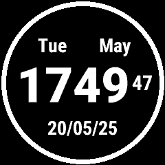
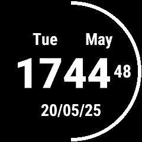
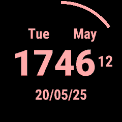

# Hermit — Garmin Watch Face

A clean, minimalist watch face for the **Garmin FR745**, built with the Connect IQ SDK. Displays time, seconds, date, day of week, month, and a battery arc — all in a single-color scheme that you can fully customize.

## Preview

| 100% | 50% | 15% (alert) |
|------|-----|-------------|
|  |  |  |

## Features

- **Large time display** — hours and minutes in a bold, easy-to-read font
- **Live seconds** — updated every second via partial screen refresh (battery-efficient)
- **Battery arc** — a thin arc around the bezel showing charge level at a glance
- **Color alert** — all elements switch to your chosen alert color when battery drops to 15% or below
- **Customizable colors** — set both the normal and alert colors directly from the Garmin Connect app
- **Burn-in protection** — seconds display is automatically disabled on OLED devices that require it

## Display Layout

```
      Mon        ← day of week
     January     ← month
  [14:35] 42     ← time (HH:MM) + seconds
    22/03/26     ← date (DD/MM/YY)
◯ ─────────────  ← battery arc (outer ring)
```

## Settings

Configure from the **Garmin Connect app** → Device → Watch Face → Settings:

| Setting | Default | Description |
|---------|---------|-------------|
| Normal Color | White | Color used when battery > 15% |
| Alert Color | Red | Color used when battery ≤ 15% |

## Installation

### Via Connect IQ Store
Search for **Hermit** in the [Connect IQ Store](https://apps.garmin.com) and install directly from the Garmin Connect app.

### Manual Sideload
1. Download `Watch.prg` from the [latest release](../../releases/latest)
2. Connect your FR745 via USB
3. Copy `Watch.prg` to `GARMIN/APPS/` on the device

## Development

### Prerequisites
- [Devbox](https://www.jetify.com/devbox) — manages the JDK17 dependency
- [Connect IQ SDK](https://developer.garmin.com/connect-iq/sdk/) — install via Garmin's VS Code extension or standalone
- A `developer_key` file at the project root (generate with the SDK tools)

### Setup
```bash
devbox shell   # activates the dev environment with JDK17
```

### Commands
```bash
devbox run build   # compile → bin/Watch.prg
devbox run sim     # launch the Connect IQ simulator
devbox run run     # run bin/Watch.prg in the simulator
devbox run test    # build + run
```

### CI Artifacts
Every push to `main`/`master` produces two artifacts via GitHub Actions:
- `Watch.prg` — device/simulator binary
- `Watch.iq` — Connect IQ store distribution package

### Project Structure
```
source/
  watchApp.mc              # application entry point
  watchView.mc             # watch face lifecycle and rendering loop
  layers/
    Layer.mc               # abstract base class for all layers
    LayerManager.mc        # coordinates updates, color, and drawing
    TimeLayer.mc           # HH:MM display
    SecondLayer.mc         # SS display with partial-update support
    DateLayer.mc           # DD/MM/YY display
    DayMonthLayer.mc       # day-of-week and month name
    BatteryLayer.mc        # arc around the bezel
resources/
  layouts/layout.xml       # element positions on screen
  fonts/                   # Hermit font family (Light, Regular, Bold + Italic)
  properties.xml           # user-configurable color defaults
  settings/settings.xml    # color picker UI for Garmin Connect app
  strings/strings.xml      # localized strings (English, Spanish)
```

## License

MIT
